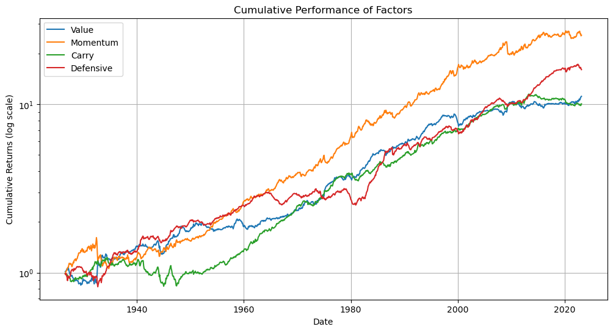

# Multivariate Time Series Forecasting with LSTM and VAR Models

In this project, we explore two different approaches to forecasting multivariate time series data, using the Value, Momentum, Carry, and Defensive factors as examples. We compare the performance of a **Multivariate LSTM** model and a **Vector Autoregression (VAR)** model.

## Data Preparation

The dataset contains monthly returns of the four factors:

1. Value
2. Momentum
3. Carry
4. Defensive

## Models

### Vector Autoregression (VAR)

We first applied a VAR model for forecasting the factors. We followed these steps:

1. Test for stationarity using the Augmented Dickey-Fuller (ADF) test.
2. Fit the VAR model with an optimal lag order, determined by minimizing the BIC.
3. Analyze the model output, including impulse response functions and forecast error variance decomposition.
4. Forecast the factors using the fitted model.
5. Evaluate the forecast accuracy using the Mean Absolute Percentage Error (MAPE).

### Multivariate LSTM

Next, we applied a Multivariate LSTM model for forecasting the factors. We followed these steps:

1. Scale the dataset using the MinMaxScaler.
2. Split the dataset into training and testing sets.
3. Reshape the input data into a 3D array format for the LSTM model.
4. Create and train an LSTM model with Conv1D, Dropout, and Dense layers.
5. (Optional) Perform hyperparameter tuning with 10-fold cross-validation and RandomizedSearchCV.
6. Forecast the factors using the fitted model.
7. Evaluate the forecast accuracy using the Mean Absolute Percentage Error (MAPE).

## Results

We compared the MAPE of the LSTM and VAR models for each factor. The results were as follows:

- Value: LSTM (0.8390) vs. VAR (0.8861)
- Momentum: LSTM (0.8975) vs. VAR (0.8803)
- Carry: LSTM (1.2852) vs. VAR (1.2089)
- Defensive: LSTM (0.9684) vs. VAR (1.1312)

In general, the forecast accuracy for both models was relatively poor. The Multivariate LSTM model performed better for Value and Defensive factors, while the VAR model performed better for Momentum and Carry factors.

## Conclusion

Both the Multivariate LSTM and VAR models have their strengths and weaknesses, and neither model provided consistently accurate forecasts across all factors. Further research and model tuning may be necessary to improve the forecast accuracy for these factors. Additionally, other models, such as Bayesian structural time series models or machine learning algorithms like XGBoost, could be explored to find a more suitable forecasting approach for this dataset.
